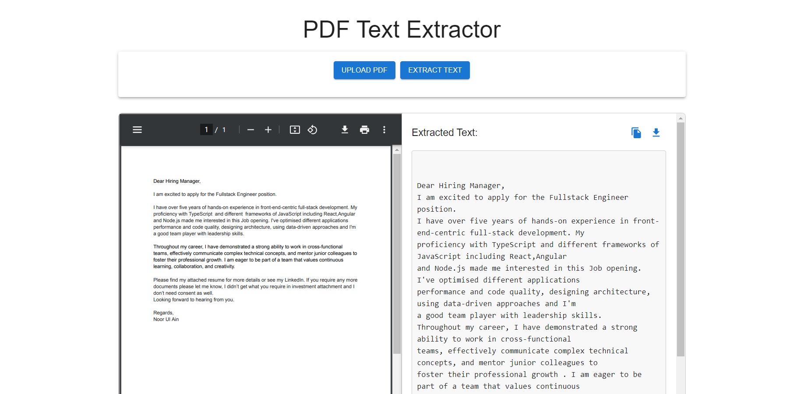

# PDF Text Extractor App

## Overview

The PDF Text Extractor App is a simple web application buit with React and Node.js that allows users to upload PDF files and extract their text content. This project demonstrates a full stack development approach, covering both the frontend and backend aspects.

## Features

- Upload a PDF file through a web interface.
- Extract and display the text content of the uploaded PDF.
- Simple and user-friendly interface with the option of clipboard and download file contents in .txt
- Security measures against malicious file upload

## Demo 



## Getting Started

### Prerequisites

- Node.js and npm installed on your machine.

### Installation

1. Clone the repository:

    ```bash
    git clone https://github.com/Noorulain-1095/pdf-text-extractor-app
    cd pdf-text-extractor-app
    ```

2. Install the dependencies:

    ```bash
    npm run update
    ```

### Running the Application

    ```bash
    npm start
    ```

    Make sure to update any environment variables in the `.env` file from `.env.example`.

### Running the Test

1. To run API test cases:

    ```bash
    npm run test
    ```

3. To run frontend test cases:

    ```bash
    npm run test-frontend
    ```
